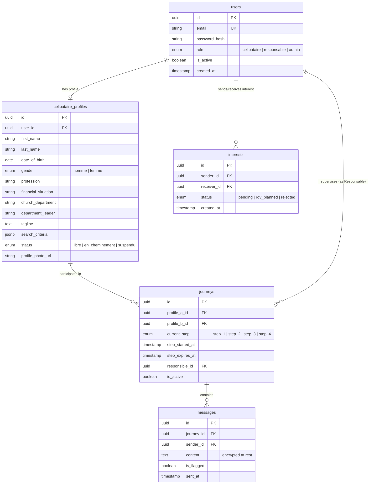

# PRD Addendum: Technical & Visual Reference — ImpactC Matrimonial Module

This document serves as a technical and visual companion to the core [prd.md](file:///c:/Users/kahonsu/Documents/GitHub/ImpactC/_bmad-output/planning-artifacts/prds/prd-ImpactC-2026-06-19/prd.md). It outlines the architecture, database schema, security mechanism details, and visual design tokens to guide downstream engineering and design teams.

---

## 1. Technical Architecture & Tech Stack

The system follows a **Decoupled Architecture** separating user interfaces from the API Gateway and application server layers.

### 1.1 Frontend Clients
- **Mobile Client (Célibataires)**:
  - **Technology**: **React Native (Expo)**.
  - **Rationale**: Single codebase for iOS and Android deployment. Mobile web responsive wrapper will serve as the initial MVP deployment, with a smooth migration path to app store build using the same codebase.
  - **Data Fetching**: **React Query (TanStack)** for caching API responses, handling server-state, loading, and error states.
- **Web Portal (Responsables & Admins)**:
  - **Technology**: **Next.js 14** (App Router).
  - **Rationale**: Excellent server-side rendering (SSR) for initial load speeds, integrated layout and routing systems.
  - **UI Components**: **Shadcn/ui** and **Radix UI** primitives for accessible, customizable, and keyboard-navigable form controls.
  - **Styling**: **Tailwind CSS** for responsive design tokens and utility-first layouts.

### 1.2 Backend Server
- **REST API & WebSocket Server**:
  - **Technology**: **Node.js + NestJS**.
  - **Rationale**: Strictly structured modular pattern (modules, controllers, services) matching enterprise-level TypeScript applications.
  - **Real-Time Communication**: **Socket.io** library handles stateful TCP socket connections between journey partners.
  - **Task Queue**: **Bull** (backed by **Redis**) handles asynchronous processes: email alerts, push notifications, and daily step expiration checks.

### 1.3 Databases and Storage
- **Primary Database**: **PostgreSQL** relational database. Used to model complex, audit-ready structures for users, relationships, and histories.
- **Object-Relational Mapper**: **Prisma ORM** for type-safe database queries.
- **Caching Layer**: **Redis** cache for managing active user sessions, socket mapping tables, and discovery feed cache.
- **Media Storage**: **AWS S3** combined with **Cloudinary** for image uploading, compression, and automated 4:5 aspect ratio cropping.

---

## 2. Database Schema Reference

The primary relational schema utilizes UUID primary keys.



---

## 3. Security & Anti-Contact Filter Logic

### 3.1 Authentication
- JWT access tokens with a short expiration of **15 minutes** are passed in request headers.
- Refresh tokens are stored in secure, **HTTP-only cookies** (`SameSite=Strict`, `Secure`) to mitigate cross-site scripting (XSS) extraction risk.

### 3.2 Anti-Contact Regex Rules
To enforce the community rule against exchanging personal contacts in Step 2, a backend middleware scans outbound chat messages.

#### Regex Phone Pattern
```regex
/(?:(?:\+|00)33|0)\s*[1-9](?:[\s.-]*\d{2}){4}/g
```
*(Supports standard French formats, including spaces, periods, dashes, and country codes).*

#### Regex Email Pattern
```regex
/[a-zA-Z0-9._%+-]+@[a-zA-Z0-9.-]+\.[a-zA-Z]{2,}/g
```

#### Regex Social Handle Pattern
```regex
/(?:facebook|instagram|twitter|snapchat|linkedin|tiktok|wa\.me|t\.me)\.(?:com|me|org)\/[a-zA-Z0-9._-]+/gi
```

#### Interception Flow
1. Message sent via WebSocket.
2. NestJS gateway intercepts content before DB write.
3. Content runs against regex array.
4. If match:
   - Message status is set to `is_flagged = true`.
   - Message is rejected from delivery (sender client receives a block error).
   - An incident record is written, sending an alert to the assigned Responsable's dashboard.

---

## 4. Visual Design Tokens & Guidelines

### 4.1 Color Palette
Colors are selected for readability, warmth, and calming contrast.

| Token | CSS Variable | Hex Code | Purpose |
| :--- | :--- | :--- | :--- |
| **Primary Slate** | `--color-slate-blue` | `#3B5998` | Primary brand headers, active tags, primary CTA buttons. |
| **Gold Accent** | `--color-soft-gold` | `#C9A84C` | Status badges, stars, highlights, onboarding progress indicators. |
| **Sage Success** | `--color-sage-green` | `#4CAF82` | Positive notifications, validated profile states, accepted status. |
| **Ambre Warning** | `--color-amber` | `#F59E0B` | Expiration alerts, pending review status indicators. |
| **Soft Red** | `--color-soft-red` | `#EF4444` | Errors, block states, anti-contact warning alerts. |
| **Off-White BG** | `--color-off-white` | `#F8F7F4` | App page background (reduces glare compared to pure `#FFF`). |
| **Secondary Light**| `--color-grey-light` | `#EFEFEF` | Card backgrounds, search input fills, border dividers. |
| **Anthracite Text**| `--color-dark-grey` | `#1F2937` | Core typography color (retains contrast without pure black harshness). |
| **Subtle Text** | `--color-mid-grey` | `#6B7280` | Subtitles, helper text labels, timestamp logs. |

### 4.2 Typography Hierarchy
Imported from Google Fonts.

- **Primary Headings (H1, H2)**:
  - **Font**: `Playfair Display`, serif.
  - **Weights**: Bold (`700`).
- **Subheadings (H3, H4)**:
  - **Font**: `Montserrat`, sans-serif.
  - **Weights**: SemiBold (`600`).
- **Body & Controls**:
  - **Font**: `Inter`, sans-serif.
  - **Weights**: Regular (`400`), Medium (`500`), SemiBold (`600`).
- **Base sizing**:
  - Body copy standard: `16px` (`1rem`).
  - Font scaling factor: `1.25` (Major Third).

### 4.3 UI Layout and Radii
- **Base Grid Unit**: 4px (`0.25rem`).
- **Paddings**: Multiples of 4: 8px, 12px, 16px, 24px, 32px.
- **Border Radii**:
  - Profile Cards: `12px` (`rounded-xl`).
  - Buttons & Inputs: `6px` (`rounded-md`).
  - Badges & Pills: Full rounded pill status layout.

---

## 5. Infrastructure & Deployment Plan

- **Backend Gateway & Server**: Deployed as a Dockerized container on **AWS ECS (Fargate)** or **Railway**.
- **Frontend client Web shell**: Deployed on **Vercel** with global CDN caching.
- **Media CDN**: Images are hosted on **AWS S3** and distributed worldwide via **AWS CloudFront** caching.
- **Relational DB**: Managed **AWS RDS PostgreSQL** instance with automatic backup windows.
- **Task Queues & WS Session Maps**: Managed **AWS ElastiCache Redis** cluster.
- **Monitoring & Logging**:
  - **Sentry** integration for tracing frontend and backend runtime exceptions.
  - **Datadog** or **CloudWatch** for API performance and resource usage metrics.
