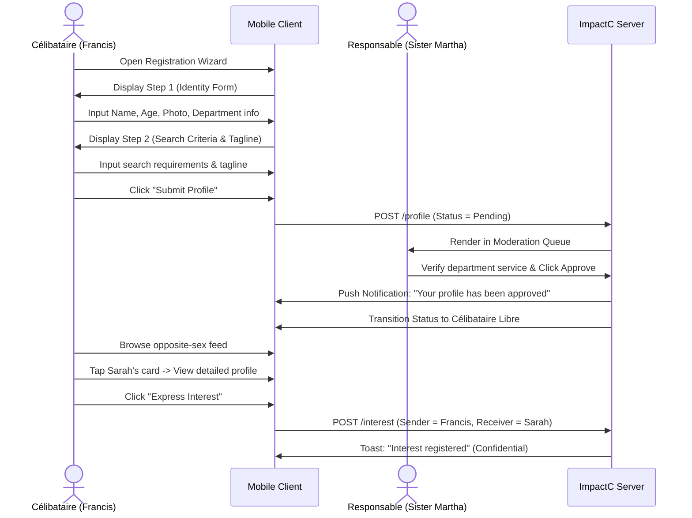
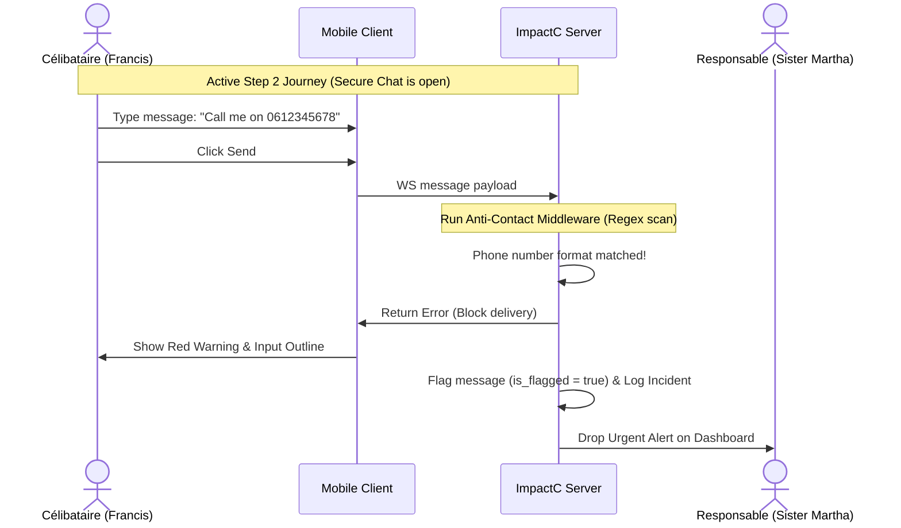

# ImpactC Matrimonial — Experience Spine

## Foundation

The Matrimonial Module of ImpactC is split into two distinct target client ecosystems:
1. **Célibataire Client**: A mobile-responsive web-app shell built using **React Native (Expo)** wrapped for the browser. It prioritizes single-column layout, touch target heights of at least `48px`, and simple tab-based navigation.
2. **Responsable Portal**: A desktop/tablet-optimized web dashboard built using **Next.js 14 (App Router)** with **Shadcn/ui** and **Radix UI**. It prioritizes high-density data tables, side navigation, multi-column metrics, and keyboard-driven grid management.

All visual styles, colors, and design parameters references in this spine inherit directly from [DESIGN.md](file:///c:/Users/kahonsu/Documents/GitHub/ImpactC/_bmad-output/planning-artifacts/ux-designs/ux-ImpactC-2026-06-19/DESIGN.md).

## Information Architecture

### Célibataire Client (Mobile-First Shell)

| Surface | Reached from | Purpose |
|---|---|---|
| Registration Wizard | Root App load (unauthenticated) | Multi-step onboarding to capture identity, church service, and search criteria. |
| Onboarding Status | Login (profile pending) | Informs user that their profile is under review by a Responsable. |
| Discover (Feed) | Bottom Tab 1 | Vertical feed of opposite-sex Célibataire Libre profiles matching filters. |
| Espace Cheminement | Bottom Tab 2 | Active couple Journey interface. Shows step progress tracker and accesses Secure Chat. |
| Notifications | Bottom Tab 3 | Chronological log of matches, step promotions, and meeting reminders. |
| My Profile | Bottom Tab 4 | Preview profile card, adjust search filters, log out. |

- **Modal Stacking**: Limits modal screens to a maximum of one layer deep (e.g. Filter modal opens over Discover, tapping outside closes it).
- **Navigation Controls**: Fixed bottom navigation bar with 4 tabs. If user status is `En Cheminement` (Step 2+), the Discover tab is replaced by an information panel, or disabled with an active indicator directing them to their Journey tab.

### Responsable Portal (Desktop/Tablet)

| Surface | Reached from | Purpose |
|---|---|---|
| Dashboard | Navigation Sidebar | KPI cards (approvals, active matches, active journeys) and action lists (anti-contact flags, expiring phases). |
| Moderation Queue | Navigation Sidebar | Grid of users with status `Pending Validation`. Handles approvals and rejection notes. |
| Matches & Interests | Navigation Sidebar | Grid tracking unilateral interests and bilateral matches. Coordinates scheduling for Step 1. |
| Journey Kanban | Navigation Sidebar | 4-column kanban board representing Step 1, Step 2, Step 3, and Step 4 of all active journeys. |
| Journey Details | Kanban Card Click | Side-by-side comparison of the couple's files, meeting notes logs, and transition triggers. |
| Audit Trail | Navigation Sidebar | Read-only searchable history logs of all moderation, step changes, and violations. |

## Voice and Tone

The application copy must maintain a serious, respectful, and encouraging tone, honoring the sacred purpose of marriage preparation. 

| Do | Don't |
|---|---|
| "Express Interest" (Confidential) | "Like", "Swipe Right", "Crush" |
| "A reciprocal interest has been detected." | "You have matched! 🎉 Check out your hot new match!" |
| "In Step 2 (One-Month Study), we communicate within this app to protect privacy." | "Sharing social media is blocked. Don't break the rules!" |
| "Your profile verification is in progress. Our relationship leaders will review it shortly." | "Verification pending. Hang tight while we check you out." |
| "This step will end in 5 days. Please coordinate with your leader." | "Timer expiring! Transition now or get booted!" |

## Component Patterns

### 1. Profile Card (`{components.profile-card}`)
- **Visual Container**: Rounded corners `{rounded.xl}`, background `#FFFFFF`, shadow `shadow-md`.
- **Primary Swipe/Scroll Interaction**: Users scroll vertically through profiles on Discover. Card header images maintain a `4:5` ratio.
- **Action Button**: A bottom fixed button ("Express Interest") styled with `{colors.primary}` background. Tapping it triggers a pulse animation on the heart icon.

### 2. Confidential Interest Action
- **Confidentiality Treatment**: Tapping "Express Interest" updates the database but gives a neutral confirmation toast: "Interest registered." No notification is sent to the target user. If a reciprocal interest is present, a Match is generated silently for Responsables.

### 3. Step Stepper
- **Track Behavior**: Renders on the Célibataire's "Cheminement" screen and the Responsable's dossier panel. Nodes representing Steps 1-4 are colored in `{colors.primary}` when completed, while active nodes pulse with a `{colors.secondary}` ring.
- **Access Restrictions**: Non-active future steps are greyed out (`{colors.bg-secondary}`) and unclickable.

### 4. Secure Chat Window
- **Warnings Banner**: A banner pinned to the top of the chat area during Step 2. Text reads: *"To maintain discretion, off-platform contact sharing is restricted during Step 2."* Background uses 10% opacity `{colors.danger}` with a solid `{colors.danger}` border.
- **Contact Masking**: When the Anti-Contact Filter intercepts a message, the bubble is not sent. The sender's interface displays a red placeholder border, and a small warning text below the input field states: *"Message blocked: Personal contacts (phone, email, social handles) are not permitted in Step 2."*

### 5. Journey Kanban Board (`{components.kanban-board}`)
- **Layout**: Four vertical columns representing the 4 Steps.
- **Cards**: Contain both partners' first names, the assigned Responsable, and a days-remaining badge. Badges turn to `{colors.danger}` background if the phase is within 5 days of expiration.
- **Drag-and-Drop**: Disabled. Step transitions are restricted to the sidebar detail panel via explicit "Promote Step" button click, requiring verification checks.

## State Patterns

### Cold App Load
- Skeleton loaders replace profile feeds and dashboard charts, rendering blank gray blocks with a shimmer effect (`animate-pulse` using `{colors.bg-secondary}`).

### Empty Discovery Feed
- If no profiles match filters or are available: a simple centered card displaying a search icon, a Playfair Display heading: "Expanding the Search," and body text: *"Adjust your filters or check back later as new members register."*

### Pending Moderation State
- Displays a prominent lock graphic at the center of the mobile screen. Text reads: *"Welcome Francis. Your department service is being verified with your leader. We will notify you once your profile is approved."*

### Active Journey (En Cheminement)
- When a Journey transitions to Step 2, the user's Discover tab is disabled. Clicking the tab displays an overlay: *"You are currently in an active Journey. Please navigate to the Journey tab to communicate."*

### Anti-Contact Warning Trigger
- Upon typing a phone number, email, or social handle in Step 2:
  - Input field outline shifts to `{colors.danger}`.
  - The send button is temporarily disabled.
  - A toast alert pops: *"Please keep communication within the platform for this phase."*
- **Audit Alert**: In the Responsable's Portal, a high-priority card drops into their Action List: *"Anti-Contact Alert: Francis (Journey with Sarah) attempted to share contact info."*

### Offline State
- If connection is lost: a top screen-width bar drops down in `{colors.text-primary}` with white text: *"Offline. Reconnecting..."* Writes are cached locally in memory.

### Expiry Notifications
- **Step 2 (30-day limit)**: At Day 25, a persistent message appears at the top of the chat: *"Step 2 review scheduled soon. Contact your leader."*
- **Step 3 (90-day limit)**: At Day 85, same warning triggers.

## Interaction Primitives

### Touch and Gesture (Mobile)
- **Vertical Feed Scrolling**: Infinite scroll pagination (loads 10 profiles at a time) to prevent loading lag.
- **Card Tapping**: Tapping a profile card expands it vertically to show detailed text fields (Vie Spirituelle, Critères) with a smooth slide-up animation.
- **Pinch and Zoom**: Disabled on profile photos to prevent inappropriate screenshot resolution downloads.

### Keyboard Navigation (Responsable Dashboard)
- **Grid Traversal**: Focus indicators highlight rows using a 2px `{colors.primary}` outline.
- **Quick Approvals**: Within the Moderation Queue, pressing `Enter` with a row highlighted slides open the details panel, and `Ctrl + A` approves the profile.

## Accessibility Floor

The platform commits to **WCAG 2.1 AA** compliance standards to ensure all church members can participate:
- **Screen Reader Announcements**: Focus switches automatically to loaded modal drawers. Form fields use explicit labels. Screen readers announce step transitions when the stepper loads: *"Journey Active. Current Stage: Step 2, One-Month Study."*
- **Target Sizes**: All interactive elements (CTA buttons, inputs, navigation tabs) hold a minimum target size of `48px` on mobile screens.
- **Focus States**: Tabbing through inputs displays a sharp 2px `{colors.primary}` border ring. Focus order strictly matches physical visual reading order (top-to-bottom, left-to-right).
- **Alt Text**: Profile photos have screen-reader descriptions: *"Profile photo of {first_name}, {age} years old."*
- **Contrast compliance**: Standard-sized texts utilize `{colors.gold-text}` (rather than `{colors.secondary}`) and `{colors.slate-text}` (rather than `{colors.primary}`) when displayed on off-white or light gray backgrounds to satisfy contrast targets.

## Responsive & Platform

- **Mobile Viewports (< 768px)**: Tab-based footer navigation, profile cards stretch to 100% device width with 16px padding, forms render in a single vertical column.
- **Tablet Viewports (768px - 1024px)**: Left-aligned thin icon menu bar, profile cards render in a 2-column grid, moderation queues collapse secondary columns (department leader, financial range) to fit.
- **Desktop Viewports (> 1024px)**: Full sidebar navigation, profile cards render in 3 or 4-column grids, Responsable tables show all metadata columns.

## Inspiration & Anti-patterns

- **Inspired by Slack & Enterprise CRM**: The relationship management dashboard borrows from high-density, focused layout tracking. The Kanban board `{components.kanban-board}` mimics pipeline tracking, ensuring no couple is forgotten or left in an expired phase.
- **Inspired by Banking/Secured Apps**: Safe, clean, and un-gamified. There are no confetti bursts when a Match is generated, nor is there a "Tinder-style" visual match dialog showing both photos overlap. The Match is handled as an administrative event requiring pastoral care.
- **Anti-pattern - Swiping**: Left or right swiping gestures are completely omitted. Swiping treats people as disposable options. Instead, users scroll vertically, tap a profile to read, and intentionally click a structured button to manifest interest.

## Key Flows

### Flow 1 — Onboarding, Search, and Expressing Interest (Francis, 28 years old)

1. **Onboarding**: Francis enters the multi-step registration wizard on his phone. He inputs personal details, uploads his profile picture, inputs his tagline, and outlines his search criteria. He submits the profile.
2. **Pending Queue**: His client displays the moderation message. In the backend, a notification is sent to the moderation queue of assigned church leaders.
3. **Approval**: Sister Martha, a Responsable, reviews Francis's profile and validates his church department activity. She approves his registration. Francis is notified and his status changes to `Célibataire Libre`.
4. **Browsing**: Francis opens the Discover feed. He scrolls through cards of verified single sisters.
5. **Expressing Interest**: He clicks on Sarah's profile card, reads her bio, and taps "Express Interest." A toast validates the click. The action remains completely hidden from Sarah's feed, preventing any awkwardness.

### Flow 2 — Anti-Contact Trigger and Warning (Sarah and Francis, Step 2 Journey)

1. **Communication**: Having matched reciprocally, Francis and Sarah are placed in a Step 2 Journey by Sister Martha. They open their secure chat channel.
2. **Anti-Contact Violation**: Francis attempts to send a message containing his direct phone number: *"Let's talk outside the app: 0612345678."*
3. **Interception**: The server middleware executes a regex scan on the message payload. The phone format is matched.
4. **Blocking**: The message delivery is blocked. Francis's chat input border turns `{colors.danger}` and an alert flashes: *"Sharing phone numbers, emails, or social media handles is prohibited during this phase."*
5. **Dashboard Escalation**: The incident is flagged in the database. On Sister Martha's dashboard, an alert badge appears under "Anti-Contact Flags" containing the details of the attempt, allowing her to address it during their next check-in.

### Flow 3 — First Appointment coordination & Transition (Sister Martha, Sarah, and Francis)

1. **Match Detection**: Sarah and Francis have both clicked "Express Interest" on each other. The system alerts Sister Martha on the Matches & Interests grid.
2. **Scheduling**: Sister Martha uses the appointment coordinator interface to view Sarah and Francis's registered availability slots. She schedules the physical meeting at the church office for Saturday at 2:00 PM.
3. **The Meeting**: The meeting takes place with Sister Martha facilitating the introduction. After 30 minutes, they conclude.
4. **Debrief**: Sister Martha calls Sarah and Francis for brief individual feedback sessions. Both confirm they would like to proceed.
5. **Promotion**: Sister Martha clicks "Approve Step 2" in the Journey Details sidebar. The system sets the statuses to `En Cheminement`, opens the chat, sets the 30-day timer, and moves the Kanban card to Column 2.

### Flow 4 — Journey Termination (Sarah requests exit)

1. **Decision**: During Step 3, Sarah decides they are not compatible. She contacts Sister Martha.
2. **Action**: Sister Martha logs into the Responsable portal, selects the active Journey for Francis & Sarah, and clicks "Terminate Journey."
3. **Closure**: The system terminates the Journey in real-time. The WebSocket channel is immediately archived. The next time Francis or Sarah open the chat, they see a message: *"This journey has been closed. Contact your leader for details."*
4. **Return to Feed**: Both user statuses are reset to `Célibataire Libre`. Their profiles reappear in the Discovery feeds of other active singles.
